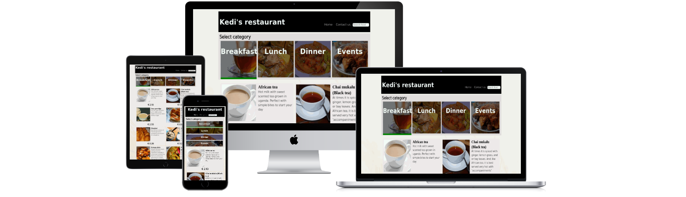
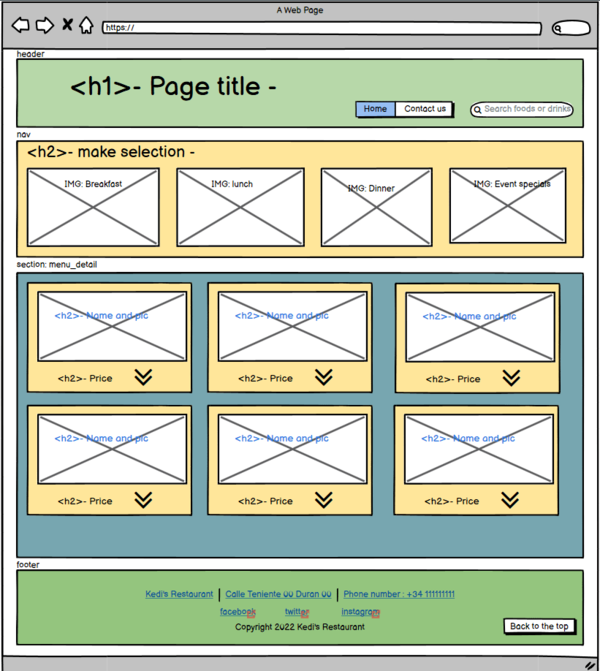
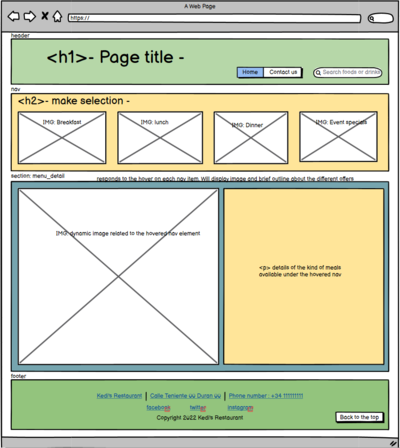
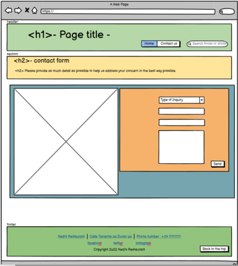
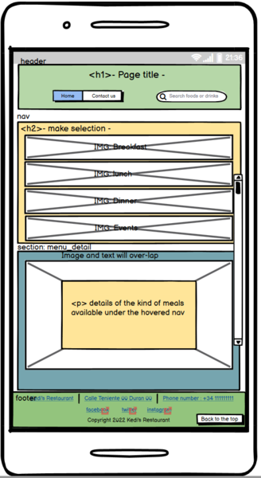
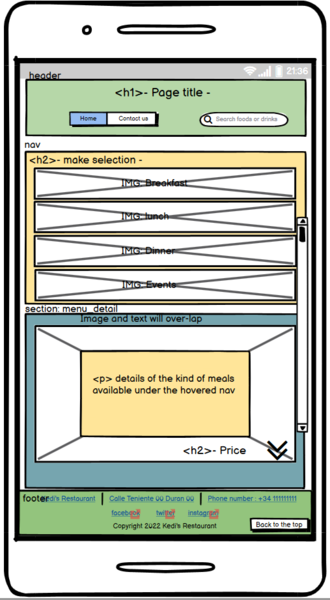
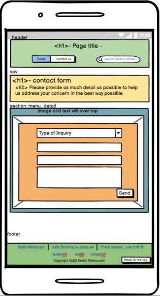

Kedi's restaurant

Table of Contents
1. Purpose of the project
2. user stories
3. Features
4. future features
5. Typography and color scheme
6. wireframes
===== Before Code/implementation ===
7. Technology
8. testing
   8.1 code validation
   8.2 test cases (user story based with screenshots)
   8.3 fixed bugs
   8.4 supported screens and browsers
9. Deployment
   9.1 via gitpod
   9.2 via github pages

10. Releases
ver1: release date 17/09/2022

ver2: release date 25/09/2022
- fixed media queries for mobile and tablet display sizes
- edited the contact form 

10. credits

1. Purpose of the project

Project aims to sell Ugandan dishes to the people of Alicante, Spain while spreading the culture of the Ugandan people. With this, there will be an indirect boost in tourism by those who would like to visit Uganda and have an experience.

2. user stories
3. Features
4. future features

Create shopping cart
Enable sign-up and Login
Integrate payment processor

5. Typography and color scheme

6. wireframes

DESKTOP PAGES

a) Home page

b) Food detail page

c) Contact Page

TABLET PAGES

a) Home page

b) Food detail page

c) Contact Page

MOBILE PAGES

a) Home page

b) Food detail page

c) Contact Page

===== Before Code/implementation ===
7. Technology
8. testing
   8.1 code validation
   8.2 test cases (user story based with screenshots)
   8.3 fixed bugs
   8.4 supported screens and browsers
9. Deployment
   9.1 via gitpod
   9.2 via github pages
10. credits

