**<h1>Kedi's restaurant</h1>**
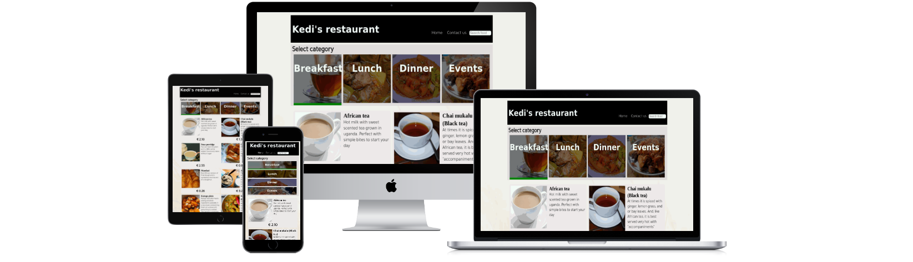

A restaurant with all the Ugandan food you miss!
Visit our [website](https://kedi1991.github.io/project01/) and check out our amazing dishes at good rates.

**<h2>Table of Contents</h2>**
<hr>

1. Purpose of the project
2. user stories
3. Features
4. future features
5. Typography and color scheme
6. wireframes
7. Technology
8. testing
   8.1 code validation
   8.2 test cases (user story based with screenshots)
   8.3 fixed bugs
   8.4 supported screens and browsers
9. Deployment
   9.1 via gitpod
   9.2 via github pages
10. Releases
11. credits
<br>
<br>

**1. Purpose of the project**

Project aims to sell Ugandan dishes to the people of Alicante, Spain while spreading the culture of the Ugandan people. With this, there will be an indirect boost in tourism by those who would like to visit Uganda and have an experience.

**2. user stories**


**3. Features**

The site is organised with graphical content to aid new users in navigating the site with ease.
The home page contains a visible header with navigation (A) to a contact form as well as the same home page incase the user is on another page. Below the Header, we have an image navigation bar (B) with links to all 4 categories of foods (Breakfast, lunch and dinner - having the same offers, and Events- parties or other ocassions) as shown in the images below.

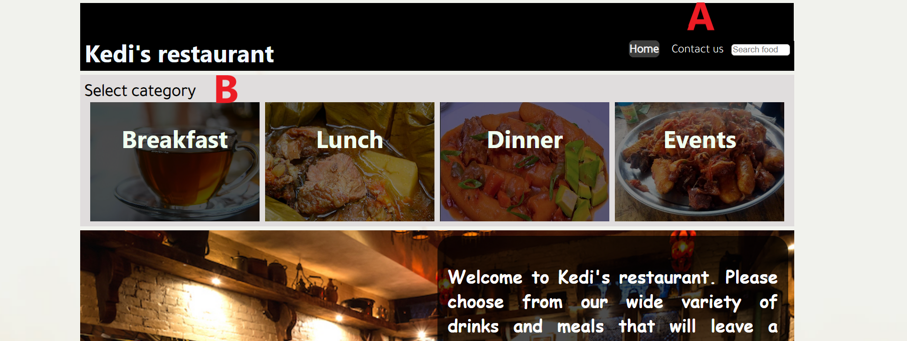

On making a selection from the food categories in image navigation, the suer will be redirected to the detailed list of all listed foods. The details will include the name (D), image and description (C), and price (E) as shown below.

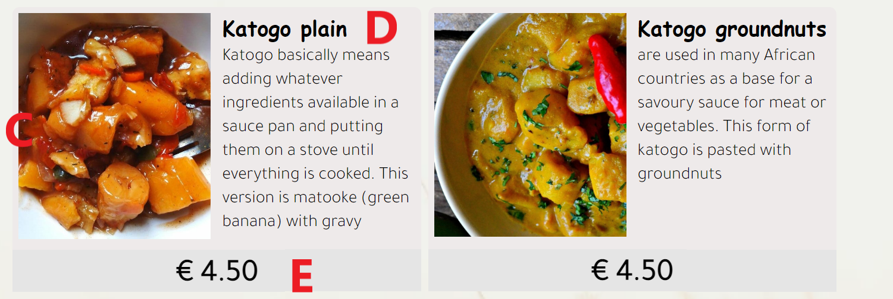

In case of any need of contacting the restaurant, there are contact details and social media links listed on the footer (G) section and a link to the contact form (F) on the header as well.

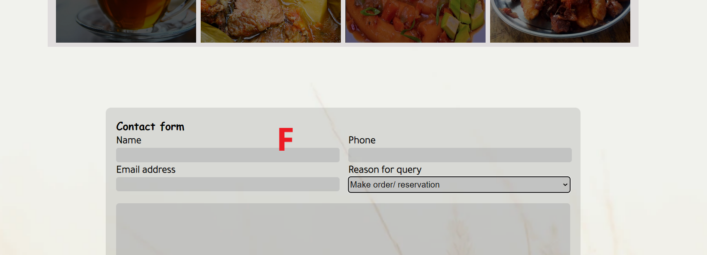


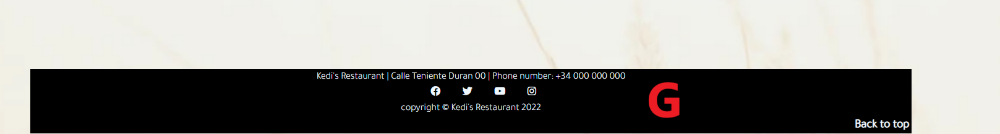


**4. future features**

- Create shopping cart
- Enable sign-up and Login
- Integrate payment processor

**5. Typography and color scheme**

Inspiration of the color scheme came from the [uber](https://www.uber.com/es/en/ride/) website. 

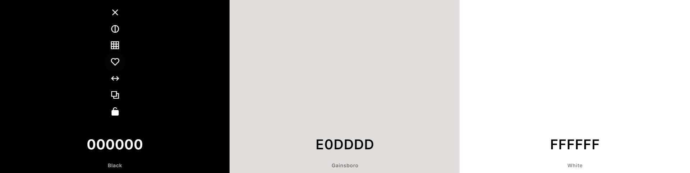

The site also uses [google fonts](https://fonts.google.com/) for the text content

Additionally, [font-awesome](https://fontawesome.com/) is used for social media icons in the footer

**6. wireframes**

**DESKTOP PAGES**

a) Home page


b) Food detail page

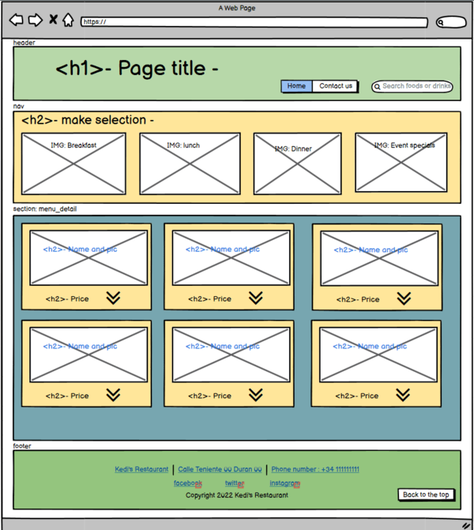

c) Contact Page


**TABLET PAGES**

a) Home page

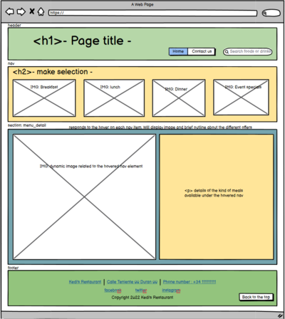

b) Food detail 


c) Contact Page

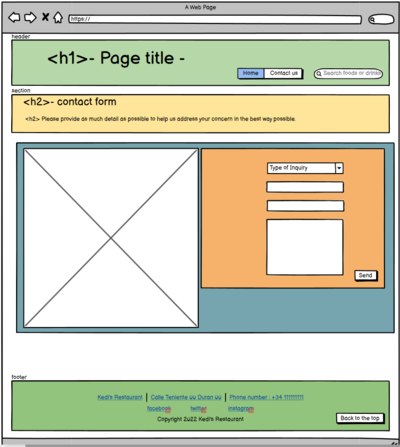

**MOBILE PAGES**

a) Home page

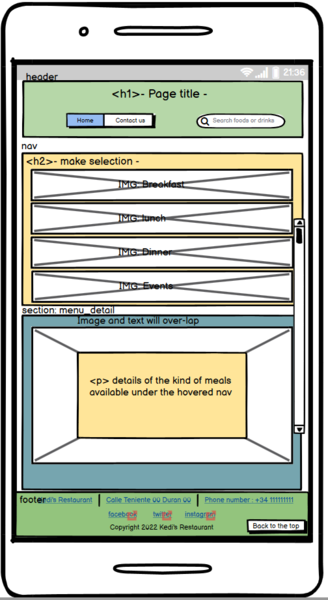

b) Food detail page

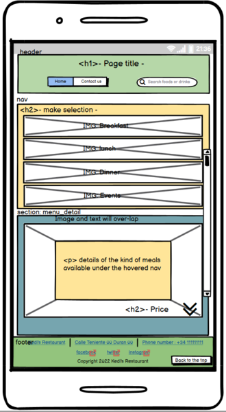

c) Contact Page

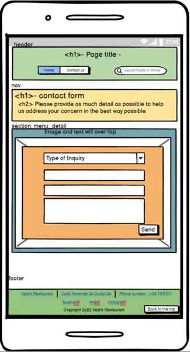

**7. Technology**

- The site is built on HTML and CSS.

**8. testing**

All html pages were tested using the [html validator](https://validator.w3.org/) and errors found were fixed as shown below

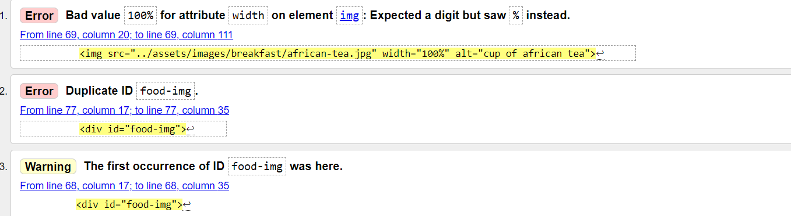


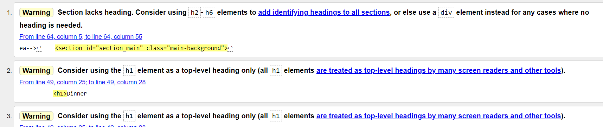
<br>
The css stylesheet code was tested using [jigsaw](https://jigsaw.w3.org/css-validator/validator) and errors found were fixed as shown below

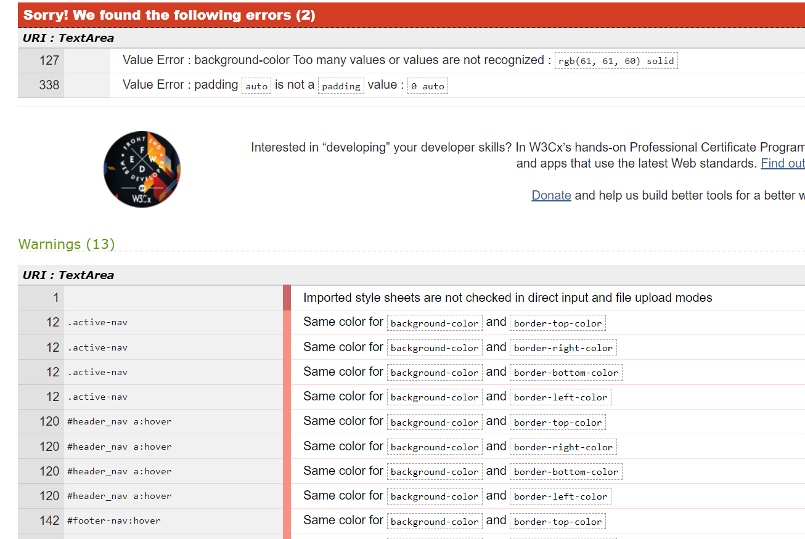

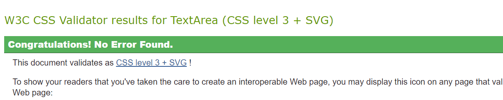
<br>

The tests were conducted on google chrome browser for desktop.

<br>

**9. Deployment**
   9.1 via gitpod

On the git terminal, run the following commands:

```python
git add .
git commit -m "commit message"
git push
```

   9.2 via github pages

**10. Version history**

ver1: release date 17/09/2022

ver2: release date 25/09/2022
- fixed media queries for mobile and tablet display sizes
- edited the contact form 


**10. credits**

**Contributors:**

**Images and recipe from;**
- pinterest
- Top Ten Uganda
- Nnyonyi.com
- newvision.co.ug
- nilepost.co.ug
- Africa food Network
- alamy.com
- tourguideuganda.com
- https://sarasglobalcooking.blogspot.com/
- https://www.alamy.com/
- daily monitor uganda
- https://4foodssakeeat.wordpress.com/
- wikipedia
- https://www.tasteatlas.com/
- chillies.co.ug

**11. Software used**
- google lens
- paint 3d
- photos
- balsamick
- google developer tools
- gitpod
- github
- firefox and google chrome
- windows snipping tool
- https://websitemockupgenerator.com/
- https://www.img2go.com/
